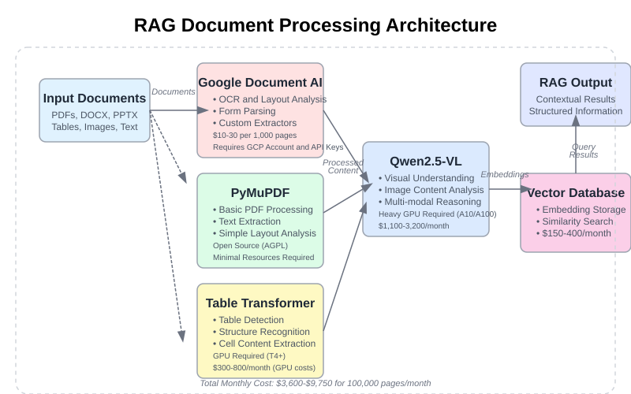
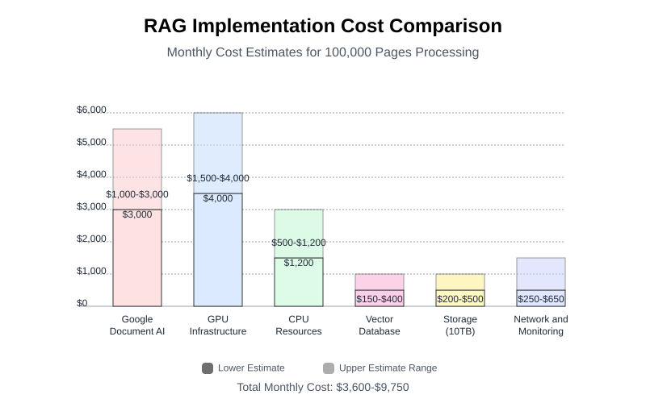
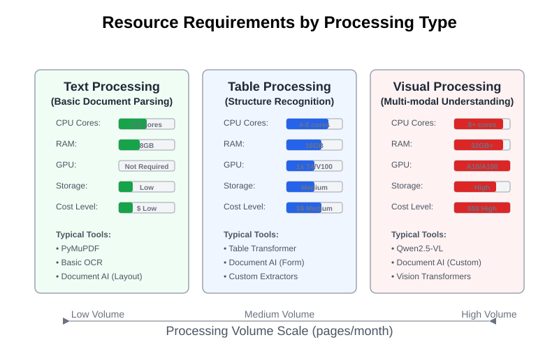
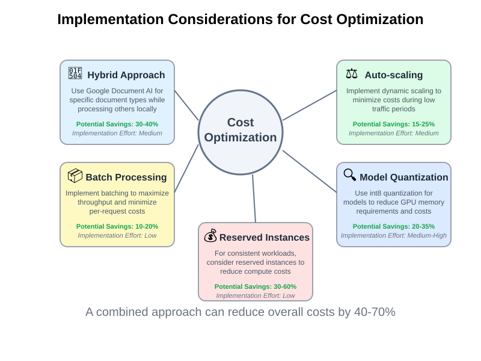

<!-- _class: lead -->
<!-- _header: '' -->
<!-- _footer: '' -->

# Tourism RAG Chatbot

## Technical Implementation Estimate

**Satya Pratheek TATA**
AI Engineering Intern
Aqxle.ai

---

<!-- Integrates various document processors for handling tourism-related content from diverse sources -->

---

<!-- Processing 100,000 pages of tourism content per month -->

---

<!-- Different resource needs across text, table, and visual content processing for tourism materials -->

---

<!-- _footer: '' -->

<!-- Implementing these strategies can reduce the overall tourism RAG system costs by 40-70% -->

---

# Implementation Timeline

- **Phase 1** (8 weeks): Core architecture setup and basic text processing
- **Phase 2** (6 weeks): Advanced parsing and vector database integration
- **Phase 3** (4 weeks): Optimization and user interface refinement
- **Phase 4** (2 weeks): Testing and deployment

---

<!-- _class: lead -->
# La Fin

Satya Pratheek TATA
AI Engineering Intern
Aqxle.ai
[LinkedIn](https://www.linkedin.com/in/satyapratheek-tata/)
[GitHub](https://github.com/TataSatyaPratheek)
