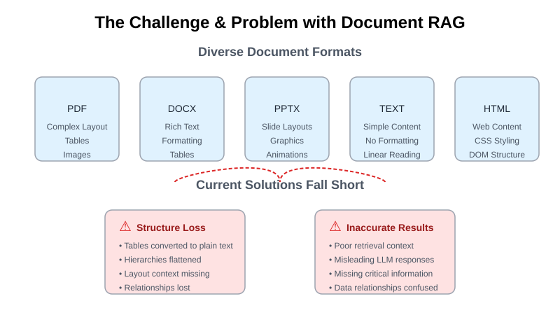
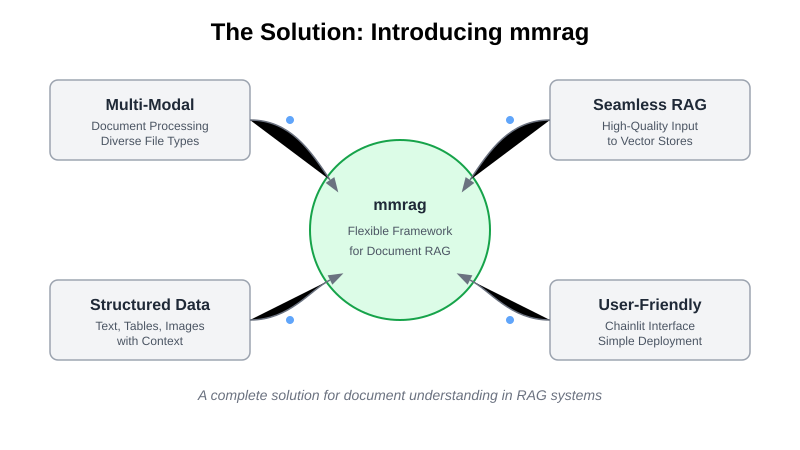
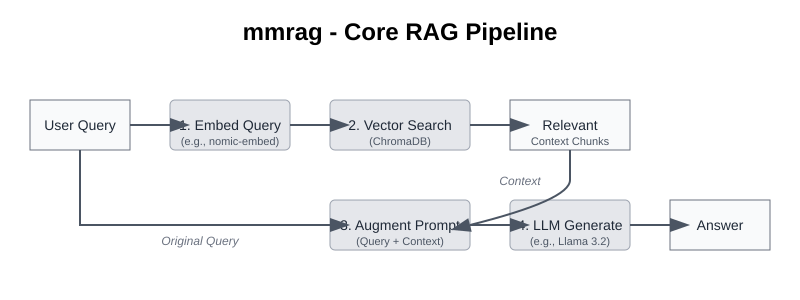
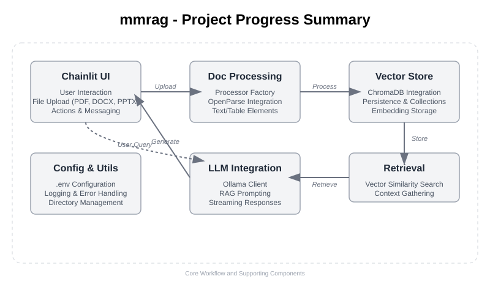
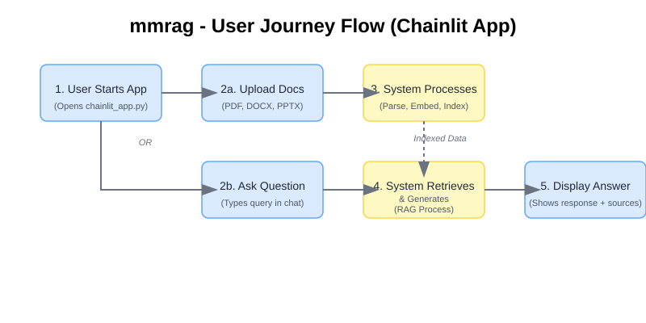
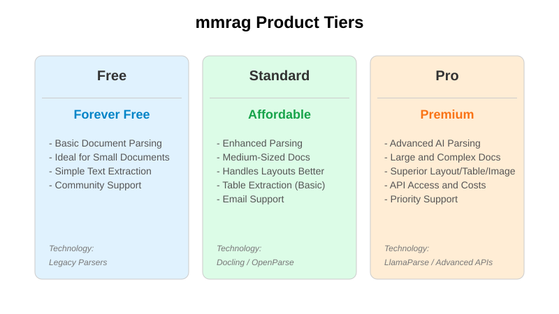
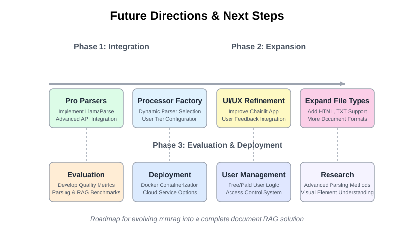

<!-- _class: lead -->
<!-- _header: '' -->
<!-- _footer: '' -->

# **mmrag: Progress & Product Vision**

**Satya Pratheek TATA**
AI Engineering Intern
Aqxle.ai

---

<!-- The challenge is to efficiently parse and extract structured data from various document types, including PDFs, Word files, and images. -->

---

<!-- `mmrag` is a versatile document processing tool that leverages advanced parsing techniques to extract structured data from documents. -->
---

At its heart, `mmrag` enables a sophisticated RAG workflow:

<!-- Notes: This pipeline shows the flow from User Query → Embedding → Vector Search → Context Retrieval → Prompt Augmentation → LLM Generation -->

---

<!-- Key integrations shown include UI, Document Processing, Vector Storage, and LLM components -->

---

<!-- The interface allows seamless document upload and contextual querying -->

---

<!-- This model provides value at every level, from free basic use to premium AI-powered parsing -->

---

<!-- Note how structure and tables are progressively better preserved as we move to premium tiers -->

---

---

<!-- _class: lead -->

# La Fin

Satya Pratheek TATA
AI Engineering Intern
Aqxle.ai
[LinkedIn](https://www.linkedin.com/in/satyapratheek-tata/)
[GitHub](https://github.com/TataSatyaPratheek)
